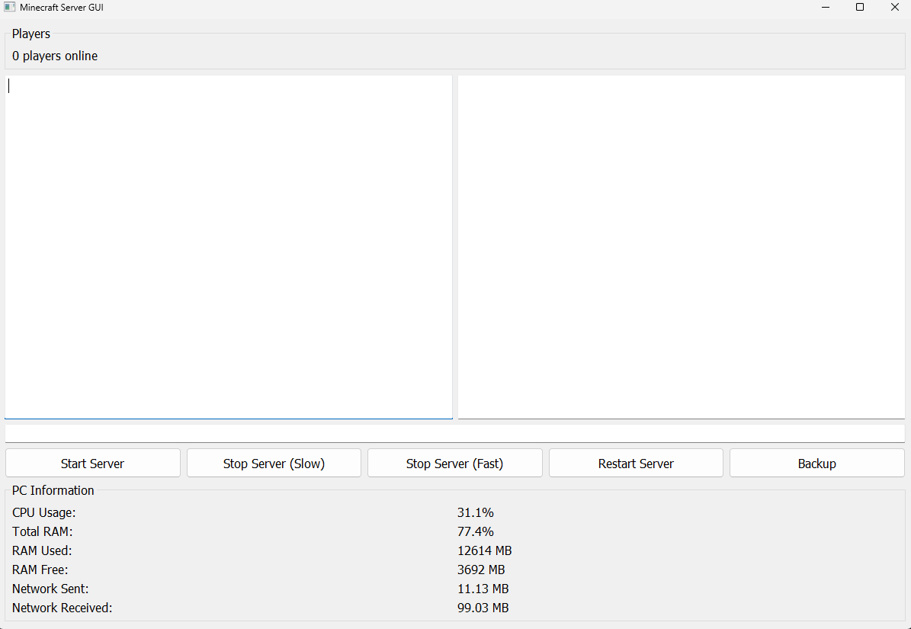

# Minecraft Server GUI [Vanilla Minecraft]

This is a graphical user interface (GUI) built in Python (PyQt5) for managing a Vanilla Minecraft Java Edition server. It allows you to start, stop, restart and backup the server with one click - and view both server logs and in-game chat separately in real-time.

## Features

- 🟢 Start, stop, and restart the server via buttons
- 💬 Split display for server logs and player chat
- 👨‍👩‍👧 Real-time player count display
- 🧠 View current PC system information:
  - CPU usage
  - RAM usage (used/free)
  - Network traffic (sent/received)
- 💾 Trigger server backups directly from the interface
- 🖥️ Clean, resizable GUI with keyboard shortcuts:
  - `↑/↓` to navigate recent commands
  - `F11` for fullscreen toggle
- ⌨️ Console input for sending server commands manually
- 🧹 ANSI color code stripping for clean text output

## Requirements

- Python 3.7+
- Java (installed and in your PATH)
- Vanilla Minecraft server `.jar`

## Folder Structure

```
project-root/
│
├── Server/
│   └── server.jar      # <-- Put your Minecraft server jar here
│
├── backup.py           # Backup logic
├── main.py             # The GUI main application
├── README.md
```

## Running the Application

Make sure the server `.jar` file is placed in the `Server` directory and named `server.jar`.

Then run the GUI with:

```bash
python main.py
```

The GUI should launch and you can start managing your Minecraft server.

## Screenshots



## Planned Features / Ideas

- 🌐 Convert GUI into a web-based interface
- 🐳 Docker integration to containerize both the Minecraft server and GUI

---

## Notes

- The current configuration sets RAM limits via `-Xms1G -Xmx3G`. You can change this in `main.py` under the constants `MIN_RAM` and `MAX_RAM`.
- The GUI will detect and display system stats using the `psutil` library.
